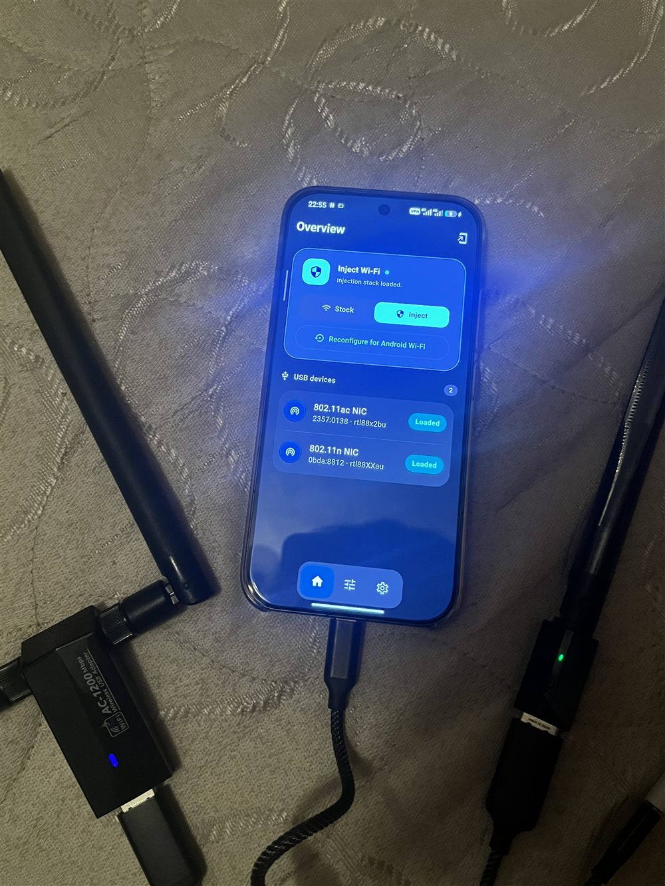
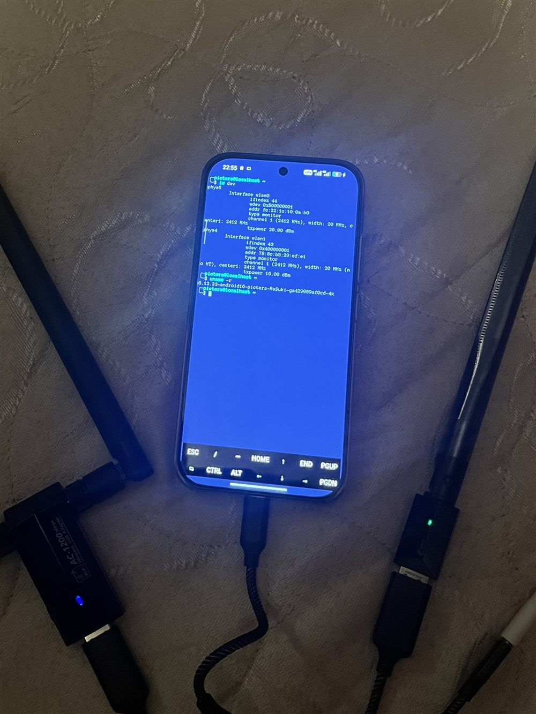

# Picters Kernel — Xiaomi SM8850

A custom Android 16 kernel for the Xiaomi Mi 17 (sm8850, "Pudding"), focused on first-class support for external USB Wi-Fi. 📡

`6.12.23-android16` &nbsp;•&nbsp; ReSukiSU (KernelSU) &nbsp;•&nbsp; SUSFS &nbsp;•&nbsp; out-of-tree USB Wi-Fi

---

## Overview

Picters Kernel extends the stock Android 16 kernel with proper support for external USB Wi-Fi adapters and a set of common out-of-tree drivers, all managed from a dedicated companion app.

- **External Wi-Fi adapters.** Realtek RTL8812AU / 8812BU / 8814AU / 8188EUS adapters work out of the box — for packet injection and monitor mode, and as a standard managed station inside stock Xiaomi Settings.
- **Bundled drivers.** Realtek Wi-Fi (aircrack-ng and morrownr), CAN bus, DVB-T / RTL-SDR and USB-serial are built in — no manual compilation required.
- **Root.** ReSukiSU (KernelSU) with SUSFS.
- **Companion app.** *Picters Modules Manager* ships with the kernel: switch Wi-Fi between Stock and Inject live (no reboot), hand an adapter back to Android, and keep the kernel, modules and app up to date.

&nbsp;&nbsp;

 
Left: the manager app with two adapters loaded. Right: both adapters in monitor mode on this kernel.

---

## Installation

1. Download the latest build from the [Releases](../../releases) page. Each build ships two archives:
   - `Mi17_Kernel-…zip` — the kernel (AnyKernel3).
   - `…OOT-Modules…zip` — the drivers and the companion app.
2. Flash both in KernelSU or Magisk (or through the companion app), then reboot.
3. The manager ships as a **system app** — enable **Show system apps** in your KernelSU/Magisk manager to find *Picters Modules Manager* and grant it root.
4. Open it, set Wi-Fi to **Inject**, and connect an adapter.

> 💡 The companion app can update the kernel, the modules and itself in a single step, with an A/B slot selector.

---

## Details

| | |
|---|---|
| **Base** | Android 16 GKI · Linux 6.12.23 · Xiaomi sm8850 |
| **Root** | ReSukiSU (KernelSU) + SUSFS |
| **Wi-Fi injection** | `88XXau` (RTL8812AU), `88x2bu` (RTL8812BU), `8814au`, `8188eus` — patched for Linux 6.12 (no UBSAN panics, correct cfg80211 hand-off) |
| **Additional drivers** | CAN, DVB-T / RTL-SDR, USB-serial (CP210x / CH341 / FTDI / PL2303) |
| **Build** | Continuous integration; each release is version-stamped for in-app updates |

---

## Credits

ReSukiSU / KernelSU · SUSFS · [aircrack-ng](https://github.com/aircrack-ng/rtl8812au) · [morrownr](https://github.com/morrownr) · AnyKernel3 (osm0sis) · [YuzakiKokuban](https://github.com/YuzakiKokuban) for the build tooling.
